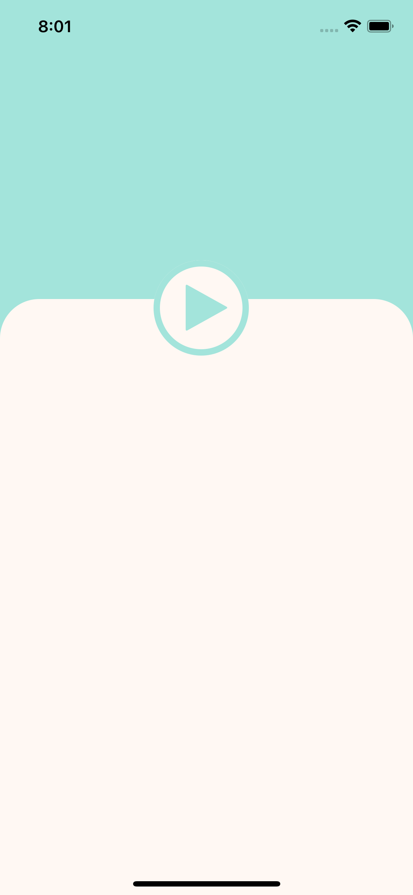
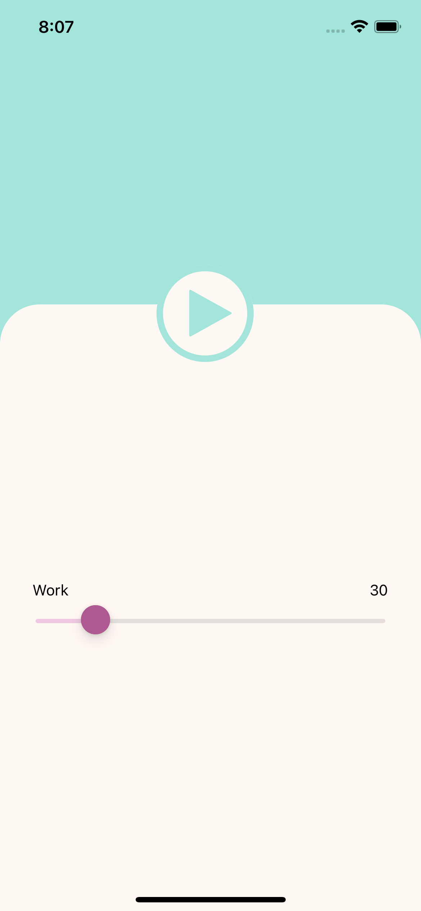
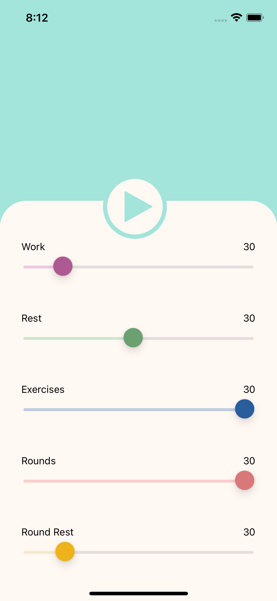
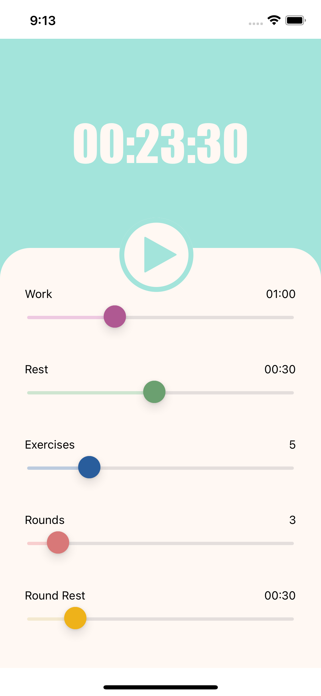

# COMPSCI 732 / Tech Demo - React Native Mobile Development

>> Kindly note that this tech demo has been primarily developed and tested on iOS and has not been extensively tested on other platforms, hence it may not function optimally on other platforms. Informations on platform differences known will still be provided but they are based on reliable sources from internet and has not been personally tested. Thank you for your understanding and hope you enjoy this Tech Demo!

==========

## How to run Interval Timer
### Step 1: Install Expo CLI
1. Run the following command globally:
```sh
npm i -g expo-cli
```

2. For MacBook users, if you encounter errors like 'The operation was rejected by your operating system'. Try this instead:
```sh
sudo npm i -g expo-cli
```

### Step 2: Download Expo Go or simulator

1. Option 1: Expo Go app
   Install the Expo Go app on your iOS or Android phone and connect to the same wireless network as your computer. On Android, use the Expo Go app to scan the QR code from your terminal to open your project. On iOS, use the built-in QR code scanner of the default iOS Camera app.

>> Kindly note that this will not work if you are using <university's Wifi>. If you do not have any access to other wireless network other than university's Wifi, please use mobile data and connect laptop to mobile hotspot, otherwise, see Option 2 or 3.

2. Option 2: iOS simulator
   Install Xcode from Macbook App Store

3. Option 3: for other development operating system, kindly refer to:
   https://reactnative.dev/docs/environment-setup?guide=native&os=windows

### Step 3: Run Interval Timer
1. Open terminal at ‘App.js' and run the following command:

```sh
npm install
npx expo start
```

>> For MacBook and iPhone user, scan the QR code with Camera app which will then lead you to Expo Go, or press i to open iOS simulator (XCode).
Otherwise, please follow the instructions in the terminal.
>> Also, please make sure that you have terminated other Expo projects before running this

Hope you enjoy my Interval Timer!

## Build your own React Native Application
### Step 1: Setting up development environment

1. Open new terminal at the folder of your preference for this project
2. Run the following command to create a new React Native project called "IntervalTimer" :

```sh
npx create-expo-app IntervalTimer
```

### Step 2: Running your React Native Application

Refer back to 'How to run Interval Timer' above, follow the instructions there to run your new project.
You should able to see this: .

### Step 3: Open developer menu
1. iPhone and Andriod
>> Shake your device to open developer menu in Expo Go

2. Xcode
>> press control + d, then command + d to open developer menu in Expo Go

==========
## React Native Introduction
1. React Native does not use any HTML elements like <div>, <p>, <a> etc., instead we will be using components provided by React Native.
>> <View> is similar to HTML's <div>
>> <Text> is used to display text

2. Styling in React Native looks similar to CSS attributes, but in fact, they are actually plain JavaScript properties.

3. Navigating between screens
>> Install the following packages:
```sh
npm install @react-navigation/native @react-navigation/native-stack
npm install react-native-screens react-native-safe-area-context
```

>> Add the following code to 'App.js':
```js
import { NavigationContainer } from '@react-navigation/native';
import { createNativeStackNavigator } from '@react-navigation/native-stack';
import Launch from './Launch';
import Timer from './Timer';

export default function App() {
  
  const Stack = createNativeStackNavigator();

  return (
    <NavigationContainer>
      <Stack.Navigator>
        <Stack.Screen component={Launch} name="Launch"/>
        <Stack.Screen component={Timer} name="Timer"/>
      </Stack.Navigator>
    </NavigationContainer>
  );
}
```

>> Add the following code to the screen components:
```js
import { Text, Button, View } from 'react-native';

export default function Launch( { navigation }) {
    return(
        <View>
            <Text> This is Launch Screen </Text>
            <Button title="click me"
            onPress={() => {
                navigation.navigate("Timer");
            }}/>
        </View>
        
    )
}
```

==========
## Build your own Interval Timer
### Step 1: Create folders and files needed for Launch Screen

1. Create a folder called 'frontend'.
2. Inside 'frontend' folder, create 'Launch.js' file, and 'styles' folder.
3. Inside 'styles' folder, create 'LaunchStyles.js'. This is where we will store all the styling needed for 'Launch.js'.

### Step 2: Launch screen interface

1. Let's start off by dividing 'Launch.js' into three sections - information container, button container and slider container:

```js
import { React } from "react";
import { View, TouchableOpacity } from "react-native";
import { styles } from "./styles/LaunchStyles";
import Icon from "react-native-vector-icons/FontAwesome";

export default function Launch() {
  return (
    <View style={styles.container}>
      <View style={styles.infoContainer}>
        {/** Place total time Text here **/}
      </View>
      <TouchableOpacity style={styles.buttonContainer} activeOpacity={0.9}>
        <Icon style={styles.playButton} name="play" size={50} />
      </TouchableOpacity>
      <View style={styles.sliderContainer}>
        {/** Place CustomSlider here: **/}
      </View>
    </View>
  );
}
```

>> 'TouchableOpacity' is a wrapper for making views respond properly to touches. On press down, the opacity of the wrapped view is decreased, dimming it. Its opacity could be changed by adding 'activeOpacity' prop.


2. Now, let's style these containers and button in 'LaunchStyles.js'

```js
import { StyleSheet } from "react-native";

export const styles = StyleSheet.create({
  container: {
    flexDirection: "column",
    justifyContent: "space-between",
    backgroundColor: "rgb(163, 228, 219)",
    flex: 1,
  },
  infoContainer: {
    flex: 3.5,
    justifyContent: "center",
    alignItems: "center",
  },
  buttonContainer: {
    justifyContent: "center",
    alignItems: "center",
    position: "absolute",
    top: "35%",
    left: "50%",
    transform: [{ translateX: -50 }, { translateY: -50 }],
    width: 90,
    height: 90,
    borderRadius: 60,
    backgroundColor: "rgb(255, 248, 243)",
    zIndex: 1,
    borderRadius: 100,
    borderWidth: 6,
    borderColor: "rgb(163, 228, 219)",
  },
  playButton: {
    zIndex: 1,
    marginLeft: "13%",
    color: "rgb(163, 228, 219)",
  },
  sliderContainer: {
    flex: 6.5,
    justifyContent: "space-evenly",
    backgroundColor: "rgb(255, 248, 243)",
    borderTopLeftRadius: 37,
    borderTopRightRadius: 37,
    paddingBottom: 15,
    paddingTop: 23,
  },
});
```

3. Replace everything in 'App.js' with the following:
```js
import { SafeAreaView, StyleSheet } from "react-native";
import Launch from "./frontend/Launch.js";

export default function App() {
  return (
    <SafeAreaView style={styles.container}>
      <Launch />
    </SafeAreaView>
  );
}

const styles = StyleSheet.create({
  container: {
    flex: 1,
  },
});
```

>> Reload and you application should be rendered like this: 
>> For Xcode, press r to reload

### Step 3: Custom Slider
In the Launch screen, we will have 5 sliders - work, rest, exercises, rounds, round rest. Let's create a custom slider component that could be reuse for each sliders.

1. In 'frontend' folder, create 'CustomSlider.js'
2. Run the following command to install the package that provides a slider component:
```sh
npm install @react-native-community/slider --save
```

To learn more about this package, please visit:
https://www.npmjs.com/package/@react-native-community/slider

3. Now, import and build the slider component in 'CustomSlider.js:
```js
import Slider from "@react-native-community/slider";
import { StyleSheet, Text, View } from "react-native";
import { useState } from "react";

export default function CustomSlider() {
  const [state, setState] = useState(30);
  return (
    <View style={styles.container}>
      <View style={styles.label}>
        <Text>Work</Text>
        <Text>{state}</Text>
      </View>
      <Slider
        minimumValue={5}
        maximumValue={180}
        value={state}
        step={1}
        onValueChange={(value) => setState(value)}
        minimumTrackTintColor="rgb(238, 201, 225)"
        thumbTintColor="rgb(175, 89, 146)"
      />
    </View>
  );
}

const styles = StyleSheet.create({
  container: {
    marginHorizontal: 30,
    marginVertical: 10,
  },
  label: {
    flexDirection: "row",
    justifyContent: "space-between",
  },
});
```

4. To render 'CustomSlider', import the component to 'Launch.js':
```js
import CustomSlider from "./CustomSlider";
```

5. Add 'CustomSlider' component as marked in 'Launch.js':

```js
{
  /** Place CustomSlider here: **/
}
<CustomSlider />;
```

>> Reload and you should be able to see this: 

### Step 4: Sliders default settings and customised styling
In order to have each CustomSlider components showing different labels, values and styles, we need to create several objects in seperate files to hold these values.

1. In 'frontend' folder, create 'DefaultSettings.js' and add the following code:
```js
//slider min and max value for each interval
export const work = {
  label: "Work",
  minValue: 5,
  maxValue: 180,
};

export const rest = {
  label: "Rest",
  minValue: 3,
  maxValue: 60,
};

export const exercises = {
  label: "Exercises",
  minValue: 1,
  maxValue: 20,
};

export const rounds = {
  label: "Rounds",
  minValue: 1,
  maxValue: 25,
};

export const roundRest = {
  label: "Round Rest",
  minValue: 3,
  maxValue: 180,
};
```
>> These are the values for sliders' label and 'CustomSlider' component's 'minimumValue' and 'maximumValue' props. 

2. In 'styles' folder, create 'SliderStyles.js' and add the following code:
```js
export const workSliderStyles = {
  main: "rgb(175, 89, 146)",
  secondary: "rgb(238, 201, 225)",
};

export const restSliderStyles = {
  main: "rgb(107, 160, 112)",
  secondary: "rgb(206, 229, 208)",
};

export const exercisesSliderStyles = {
  main: "rgb(41, 93, 156)",
  secondary: "rgb(188, 203, 223)",
};

export const roundsSliderStyles = {
  main: "rgb(216, 120, 120)",
  secondary: "rgb(248, 206, 206)",
};

export const roundRestSliderStyles = {
  main: "rgb(238, 178, 26)",
  secondary: "rgb(243, 233, 207)",
};
```

>> 'main' color will be used for 'CustomSlider' component's 'thumbTintColor' prop while 'secondary' color will be used for 'minimumTrackTintColor' prop.
>> 'workSliderStyles', 'restSliderStyles' and 'roundRestSliderStyles' will also be used in Timer screen with 'secondary' as background color and 'main' as circular progress track color. 

3. In 'Launch.js', import the files you have just created:
```js
import { workSliderStyles, restSliderStyles, exercisesSliderStyles, roundsSliderStyles, roundRestSliderStyles } from "./styles/SliderStyles";
import { work, rest, exercises, rounds, roundRest } from "./DefaultSettings";
```

4. Now, let's modify 'CustomSlider.js' so that we can pass in these values as parameters:
```js
export default function CustomSlider({ type, sliderStyle }) {
  const [state, setState] = useState(30);
  return (
    <View style={styles.container}>
      <View style={styles.label}>
        <Text>{type.label}</Text>
        <Text>{state}</Text>
      </View>
      <Slider
        style={styles.slider}
        value={state}
        step={1}
        onValueChange={(value) => setState(value)}
        minimumValue={type.minValue}
        maximumValue={type.maxValue}
        minimumTrackTintColor={sliderStyle.secondary}
        thumbTintColor={sliderStyle.main}
      />
    </View>
  );
}
```
>> Objects from 'DefaultSettings.js' will be pass in as 'type' while objects from 'SliderStyles.js' will be pass in as 'sliderStyle'.

5. In 'Launch.js', modify 'CustomSlider' component to as follow:
```js
    {/** Place CustomSlider here: **/}
    <CustomSlider
        type={work}
        sliderStyle={workSliderStyles}/>
    <CustomSlider
        type={rest}
        sliderStyle={restSliderStyles}/>
    <CustomSlider
        type={exercises}
        sliderStyle={exercisesSliderStyles}/>
    <CustomSlider
        type={rounds}
        sliderStyle={roundsSliderStyles}/>
    <CustomSlider
        type={roundRest}
        sliderStyle={roundRestSliderStyles}/>
```
>> Again, objects from 'DefaultSettings.js' are passed into 'type'. Objects from 'SliderStyles.js' are passed into 'sliderStyle'.
>> Reload and you should be able to see this: 

### Step 5: Global state
You might have noticed that we have yet to set value labels (time or count) for each sliders. In order to achive this, we will need to have global states that will change as the slider changes. These values will going to be used in Timer screen too.

1. In 'frontend' folder, create 'AppContextProvider.js' and add the following code:

```js
import React from "react";
import { useState } from "react";

export const AppContext = React.createContext({});

export function AppContextProvider({ children }) {
  const [slider, setSlider] = useState({
    //default slider value on first load
    work: 60,
    rest: 30,
    exercises: 5,
    rounds: 3,
    roundRest: 30,
  });

  function handleSlider(key, value) {
    //get value on slider change
    const newSlider = { ...slider, [key]: value };
    setSlider(newSlider);
  }

  function formatTime(totalSec) {
    //convert seconds into min:sec format for slider label and countdown timer
    let minutes = Math.floor(totalSec / 60);
    let seconds = totalSec % 60;
    minutes = minutes < 10 ? "0" + minutes : minutes;
    seconds = seconds < 10 ? "0" + seconds : seconds;
    return `${minutes}:${seconds}`;
  }

  const context = {
    slider,
    handleSlider,
    formatTime,
  };

  return <AppContext.Provider value={context}>{children}</AppContext.Provider>;
}
```

2. In 'App.js', import 'AppContextProvider' and wrap everything with it:
```js
import { AppContextProvider } from "./frontend/AppContextProvider";

export default function App() {
  return (
    <AppContextProvider>
      <SafeAreaView style={styles.container}>
        <Launch />
      </SafeAreaView>
    </AppContextProvider>
  );
}
```

3. In 'Launch.js', import the following:

```js
import { useContext } from "react";
import { AppContext } from "./AppContextProvider";
```

4. Inside 'Launch' component, add the following:

```js
const { slider, handleSlider } = useContext(AppContext);
```

5. Now, let's modify 'CustomSlider.js' so that we can pass in the global states as parameters:
```js
export default function CustomSlider({ type, state, setState, sliderStyle, isTime,}) {
  
  const { formatTime } = useContext(AppContext);
  let valueLable = state;

  if (isTime) {
    // Some  of the slider settings are in time format
    valueLable = formatTime(valueLable);
  }

  return (
    <View style={styles.container}>
      <View style={styles.label}>
        <Text>{type.label}</Text>
        <Text>{valueLable}</Text>
      </View>
      <Slider
        style={styles.slider}
        minimumValue={type.minValue}
        maximumValue={type.maxValue}
        value={state}
        step={1}
        onValueChange={(value) => setState(value)}
        minimumTrackTintColor={sliderStyle.secondary}
        thumbTintColor={sliderStyle.main}
      />
    </View>
  );
}
```

Don't forget to import these too:

```js
import { AppContext } from "./AppContextProvider";
import { useContext } from "react";
```

6. Let's pass in the global state at 'Launch.js'. Modify the CustomSlider components to as follow:
```js
    {/** Place CustomSlider here: **/}
    <CustomSlider
        type={work}
        state={slider.work}
        setState={(value) => handleSlider('work', value)}
        sliderStyle={workSliderStyles}
        isTime={true}/>
    <CustomSlider
        type={rest}
        state={slider.rest}
        setState={(value) => handleSlider('rest', value)}
        sliderStyle={restSliderStyles}
        isTime={true}/>
    <CustomSlider
        type={exercises}
        state={slider.exercises}
        setState={(value) => handleSlider('exercises', value)}
        sliderStyle={exercisesSliderStyles}/>
    <CustomSlider
        type={rounds}
        state={slider.rounds}
        setState={(value) => handleSlider('rounds', value)}
        sliderStyle={roundsSliderStyles}/>
    <CustomSlider
        type={roundRest}
        state={slider.roundRest}
        setState={(value) => handleSlider('roundRest', value)}
        sliderStyle={roundRestSliderStyles}
        isTime={true}/>
```

>> Reload and you should be able to see this: 

### Step 6: Total time display
Let's continue by adding total time display which will change accordingly as the sliders value changed.

1. In 'Launch' component, add the following:
```js
function calculateTotalTime() {
  const totalSec = ((slider.work + slider.rest) * slider.exercises + slider.roundRest) * slider.rounds;
  let hours = Math.floor(totalSec / 3600);
  let minutes = Math.floor((totalSec % 3600) / 60);
  let seconds = totalSec % 60;

  hours = hours < 10 ? "0" + hours : hours;
  minutes = minutes < 10 ? "0" + minutes : minutes;
  seconds = seconds < 10 ? "0" + seconds : seconds;
  return `${hours}:${minutes}:${seconds}`;
}
```
>> This function calculate the total time and return the value in HH:MM:SS format.

2. Import the following to 'Launch.js':
```js
import { Text } from "react-native";
```

3. Inside 'infoContainer', add the following:

```js
{
  /** Place total time Text here **/
}
<Text style={styles.time}>{calculateTotalTime()}</Text>;
```

3. In 'LaunchStyles.js', add the following to 'styles':
```js
    time: {
      color: 'rgb(255, 248, 243)',
      fontSize: 60,
      fontFamily: 'Impact',
      textAlign: 'center',
      marginTop: 'auto',
      marginBottom: 'auto',
    }
```
>> Reload and you should be able to see this: 

### Step 7: Navigation
Now, let's navigate to Timer screen when play button is pressed.

1. First, install the following packages:
```sh
npm install @react-navigation/native @react-navigation/native-stack
npm install react-native-screens react-native-safe-area-context
```


2. Import the following in 'App.js':

```js
import { NavigationContainer } from "@react-navigation/native";
import {createNativeStackNavigator} from '@react-navigation/native-stack';
```
>> For more information, please visit: https://reactnative.dev/docs/navigation

3. In App(), add the following code:
```js
const Stack = createNativeStackNavigator();
```

This is used to create a stack navigator by passing screen components as parameters to 'Stack.Screen'.

4. In 'App.js', replace Launch component with the following:

```js
<NavigationContainer>
  <Stack.Navigator screenOptions={{ headerShown: false }}>
    <Stack.Screen name="Launch" component={Launch} />
    <Stack.Screen name="Timer" component={Timer} />
  </Stack.Navigator>
</NavigationContainer>
```
>> 'headerShown' is used to turn off the application's title bar. Set it to 'true' to see the difference.
>> Take note of 'Stack.Screen' 'name' prop, this will be used later in Launch and Timer screen for navigation. 
>> 'Launch' and 'Timer' components are passed into 'component' prop. This will allow them to receive a prop called 'navigation' which can link to other screens. See point 7.

5. Create 'Timer.js' in 'frontend' folder and add the following code:
```js
import { React } from "react";
import { Text } from "react-native";

export default function Timer({ navigation }) {
  return <Text>Timer app</Text>;
}
```

6. In 'App.js', import 'Timer' component:

```js
import Timer from "./frontend/Timer.js";
```

7. Now we have all the navigation elements ready, let's go back to 'Launch.js' to modify the start button.

Add 'navigation' prop as shown:
```js
export default function Launch({ navigation }) {}
```
>> Refer back to point 4 on how 'Launch' component has passed into 'component' prop.  


8. Add handleOnPress() inside 'Launch' component:
```js
function handleOnPress() {
  //Navigate to Timer screen on start button press
  navigation.navigate("Timer");
}
```
>> When this function is called, users will be navigated to Timer screen . The prop passed into 'navigation.navigate', ie. 'Timer', must be the same as the 'name' prop in 'Stack.Screen'. (Refer to point 4)

9. Modify 'TouchableOpacity' to the following so that handleOnPress() is called when pressed:
```js
<TouchableOpacity
  style={styles.buttonContainer}
  onPress={handleOnPress}
  activeOpacity={0.9}>
  <Icon style={styles.playButton} name="play" size={50} />
</TouchableOpacity>
```
>> You should able to navigate to Timer screen by clicking the start button now.

### Step 8: Timer screen styling
In Timer screen, we want the background color and circular progress track color will change according to the interval.

1. Hence, import the following into 'Timer.js':
```js
import { workSliderStyles, restSliderStyles, roundRestSliderStyles } from "./styles/SliderStyles";
import { React, useState, useContext, useEffect } from "react";
import { Text, View, TouchableOpacity } from "react-native";
import { AppContext } from "./AppContextProvider";
import Icon from "react-native-vector-icons/FontAwesome";
```

2. Inside 'Timer' component, set 'workSliderStyles' as the default state for 'color':
```js
const [color, setColor] = useState(workSliderStyles);
```

3. Now, let's divide the Timer screen into 2 sections - status container and timer container:
```js
return (
  <View style={[styles.container, { backgroundColor: color.secondary }]}>
    <View style={styles.statusContainer}>
      {/** Place status box here **/}
    </View>
    <View style={styles.timerContainer}>
      {/** Place CountdownCircularTimer here **/}
      {/** Place TouchableOpacity here **/}
    </View>
  </View>
);
```

4. In 'styles' folder, create 'TimerStyles.js' and add the following code:
```js
import { StyleSheet } from "react-native";

export const styles = StyleSheet.create({
  container: {
    flexDirection: "column",
    justifyContent: "space-evenly",
    alignItems: "center",
    flex: 1,
  },
  statusContainer: {
    flex: 2,
    flexDirection: "column",
    justifyContent: "space-evenly",
    width: "100%",
    marginTop: 10,
  },
  timerContainer: {
    flex: 8,
    justifyContent: "space-evenly",
    alignItems: "center",
  },
});
```

5. In 'Timer.js', import 'TimerStyles.js':
```js
import { styles } from "./styles/TimerStyles";
```

### Step 9: Countdown Circle Timer
1. Install the following package that provides a circular progress component:
```sh
npm i react-native-countdown-circle-timer
```
>> To learn more, please visit: https://www.npmjs.com/package/react-native-countdown-circle-timer

2. Import the package to 'Timer.js':
```js
import { CountdownCircleTimer } from "react-native-countdown-circle-timer";
```

3. Inside 'timerContainer', add the following:
```js
<CountdownCircleTimer
  isPlaying={true}
  duration={10}
  size={330}
  strokeWidth={10}
  trailStrokeWidth={5}
  colors={color.main}
  trailColor={"rgba(255, 248, 243, .5)"}
  rotation="counterclockwise"
/>
```
>> Reload and you should be able to see this: 

### Step 10: Countdown function
In order for the countdown to function, we need to retrieve the sliders' state using useContext and useState to keep track on current time, exercise and round.

1. In order for the countdown timer to function, we will first need to know the sliders' state:
```js
const { slider, formatTime } = useContext(AppContext);
```

2. Several useState will also be used to keep track on current time, exercise, round etc.
```js
const [isRunning, setIsRunning] = useState(true);
const [currentInterval, setCurrentInterval] = useState(INTERVALS.WORK);
const [currentTime, setCurrentTime] = useState(slider.work);
const [currentExercise, setCurrentExercise] = useState(1);
const [currentRound, setCurrentRound] = useState(1);
const [duration, setDuration] = useState(slider.work);
```

3. Add the following code for identifying interval:
```js
const INTERVALS = {
  WORK: "WORK",
  REST: "REST",
  ROUND_REST: "ROUND REST",
};
```

4. Now, let's add the interval function:
```js
function switchToWork() {
  setCurrentInterval(INTERVALS.WORK);
  setCurrentTime(slider.work);
  setDuration(slider.work);
  setColor(workSliderStyles);
}

useEffect(() => {
  if (!isRunning) {
    return;
  }

  const interval = setInterval(() => {
    setCurrentTime((prevTime) => {
      if (prevTime > 1) {
        return prevTime - 1;
      } else {
        //End of interval, switch to next one
        switch (currentInterval) {
          case INTERVALS.WORK:
            // Switch to rest
            setCurrentInterval(INTERVALS.REST);
            setCurrentTime(slider.rest);
            setDuration(slider.rest);
            setColor(restSliderStyles);
            break;
          case INTERVALS.REST:
            if (currentExercise === slider.exercises) {
              //End of last exercise of current round, switch to round rest
              setCurrentInterval(INTERVALS.ROUND_REST);
              setCurrentTime(slider.roundRest);
              setDuration(slider.roundRest);
              setColor(roundRestSliderStyles);
            } else {
              //Switch to work
              setCurrentExercise((prevExercise) => prevExercise + 1);
              switchToWork();
            }
            break;
          case INTERVALS.ROUND_REST:
            if (
              currentRound === slider.rounds &&
              currentExercise === slider.exercises
            ) {
              //End of last exercise of last round, clear timer and navigate back to Launch screen
              clearInterval(interval);
              onComplete();
            } else {
              //Start a new round
              switchToWork();
              setCurrentExercise(1);
              setCurrentRound((prevRound) => prevRound + 1);
            }
            break;
        }
        return prevTime;
      }
    });
  }, 1000);

  return () => clearInterval(interval);
}, [isRunning, currentInterval, currentExercise, currentRound, currentTime]);
```

5. When all intervals are complete, navigate to Launch screen:
```js
function onComplete() {
  //Navigate back to Launch screen
  navigation.navigate("Launch");
}
```

6. Change 'CountdownCircleTimer' component's 'duration' to the duration set for each interval:
```js
duration = { duration };
```

>> You will notice the countdown circular progress became slower. This is because it is running on the work time duration set. Try to change the work time duration settings in Launch screen, the circular progress should change accordingly.

7. We want to let the timer run continuously until all interval complete. To achieve this, add 'onComplete' prop in 'CountdownCircleTimer' component:
```js
    onComplete={() => {
        return {shouldRepeat: true, delay: 1}
    }}
```
>> When the countdown timer is complete, it will repeat again.

8. You probably noticed that the circular progress started half way after the first interval. This is because the 'duration' prop in 'CountdownCircleTimer' component did not change accordingly even we have set a new 'duration' state. To pass in a new duration, we need to restart the timer using 'key' prop.
```js
key = { currentInterval };
```
>> Now, the timer will restart whenever 'currentInterval' changed.

9. Though the circular progress is working fine, we should add a numeric timer for better user experience. In order to add text inside the countdown circle, we will need to pass the text into 'children' prop of 'CountdownCircleTimer' component.
```js
children={()=> {
    const time = formatTime(currentTime)
    return (
        <View>
            <Text style={[styles.circularText, {color: color.main}, {fontSize: 80}]}>{time}</Text>
            <Text style={[styles.circularText, {color: color.main}, {fontSize: 35}]}>{currentInterval}</Text>
        </View>
    )
}}
```
>> You should be able to see the numeric timer and current interval.

9. Style the timer and interval text by adding this to 'styles' in 'TimerStyles.js':
```js
circularText: {
        fontFamily: 'Impact',
        textAlign: 'center',
        marginTop: 'auto',
        marginBottom: 'auto',
    },
```
>> Reload and you should able to see this: 

### Step 11: Pause and resume timer
Pausing and resuming timer is simple, we just need to add a button, an event handler and modify 'isPlaying' prop of 'CountdownCircleTimer' component.

1. Insert the following 'TouchableOpacity' as marked in 'Timer.js':
```js
<TouchableOpacity
  onPress={isRunning ? resumeTimer : pauseTimer}
  style={[styles.buttonContainer, { backgroundColor: color.main }]}
  activeOpacity={0.9}
>
  <Icon
    name={isRunning ? "pause" : "play"}
    size={50}
    style={isRunning ? styles.pauseButton : styles.playButton}
  />
</TouchableOpacity>
```

2. Add the styling to 'styles' in 'TimerStyles.js':
```js
buttonContainer: {
        justifyContent: 'center',
        alignItems: 'center',
        width: 90,
        height: 90,
        borderRadius: 60,
        zIndex: 1,
    },
    playButton: {
        zIndex: 1,
        marginLeft: '13%',
        color: 'rgba(255, 248, 243,0.9)',
    },
    pauseButton: {
        zIndex: 1,
        marginHorizontal: 'auto',
        color: 'rgba(255, 248, 243,0.9)',
    }
```

3. Add the following event handler functions in 'Timer' component:
```js
function resumeTimer() {
  setIsRunning(false);
}

function pauseTimer() {
  setIsRunning(true);
}
```

4. Now, modify 'isPlaying' prop in 'CountdownCircleTimer' component as follow:

```js
isPlaying = { isRunning };
```
>> Reload, you timer should be able to pause and resume when button is pressed.

## # Step 12: Exercise and round count
Now, we are going to add two boxes that display current exercise and round that the user is working on.

1. Add the following code inside 'statusContainer' as marked:
```js
    {/** Place status box here **/}
    <View style={styles.statusBox}>
        <Text style={[{color:color.main}, {fontFamily: 'Impact'}, {fontSize: 18}]}>Round</Text>
        <Text style={[{color:color.main}, {fontFamily: 'Impact'}, {fontSize: 18}]}>{currentRound}/{slider.rounds}</Text>
    </View>
    <View style={styles.statusBox}>
        <Text style={[{color:color.main}, {fontFamily: 'Impact'}, {fontSize: 18}]}>Exercise</Text>
        <Text style={[{color:color.main}, {fontFamily: 'Impact'}, {fontSize: 18}]}>{currentExercise}/{slider.exercises}</Text>
    </View>
```

2. Add the following to 'styles' in 'TimerStyles.js'
```js
 statusBox: {
        flexDirection: 'row',
        justifyContent: 'space-between',
        alignItems: 'center',
        padding: 10,
        height: 50,
        borderRadius: 5,
        borderColor: 'rgba(255, 248, 243, .5)',
        borderWidth: 1,
        marginVertical: 5,
        marginHorizontal: 10,
    },
```
>> Finally, we've completed building this Interval Timer. Thank you for your patience to follow along until this very end. Hope you enjoy this tech demo!
